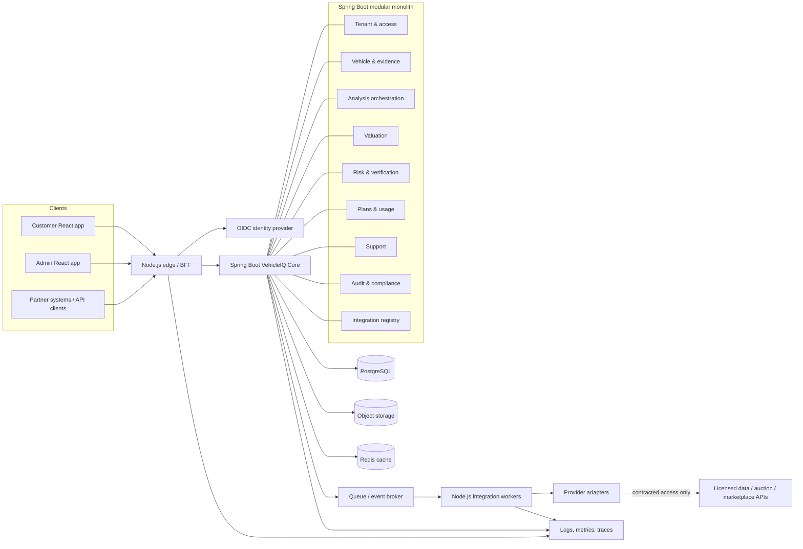
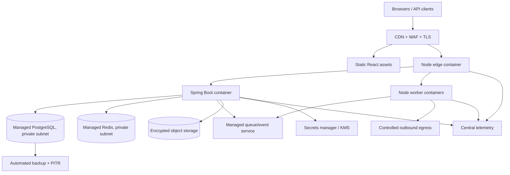
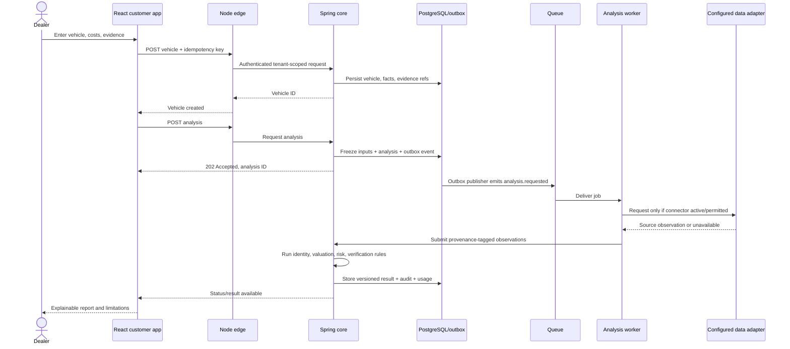
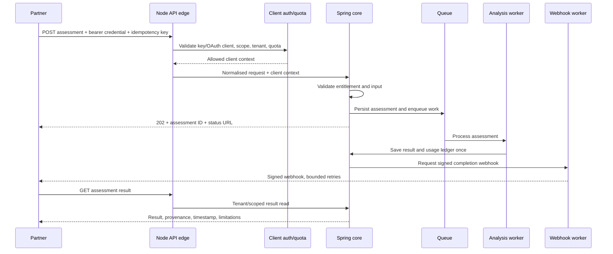

# VehicleIQ Technology Architecture and System Design

**Version:** 1.0 · **Date:** 7 October 2026 · **Status:** Proposed target architecture

## 1. Purpose and design position

VehicleIQ is a vehicle intelligence product for dealers and traders: it turns vehicle identity, available history, condition evidence, market comparables, and transaction costs into a traceable acquisition and resale assessment. The same analysis capability may later be sold as an API to marketplaces, auction operators, finance providers, and other software platforms.

This document describes a staged architecture. It does not imply that VehicleIQ has live data-provider, Copart, auction, marketplace, payment, or identity-provider integrations. Each external connection is subject to commercial agreement, technical access, permitted use, and data rights. Until then, the system supports user-entered data, uploaded evidence, and explicitly licensed providers selected by the company.

The key design decision is a **modular monolith for the first product**, with clear domain modules and asynchronous job boundaries. Spring Boot owns business rules and the system of record. Node.js provides the API edge and isolates partner-specific protocols. React/JavaScript provides the customer and internal applications. Modules can be extracted into independently deployed services when measured scale, partner isolation, or team ownership justifies it.

### Principles

1. Vehicle analysis is a versioned, explainable assessment, not an opaque score.
2. Source, timestamp, licence, and confidence travel with every material fact.
3. Separate observed facts, provider assertions, user input, and model-derived estimates.
4. Tenant isolation, least privilege, and auditability are built into the data model.
5. External integrations are adapters behind contracts; no screen depends on one provider.
6. Start with deterministic rules and human review; introduce statistical models only after suitable data and validation exist.
7. Minimise personal data. Vehicle data may still be commercially sensitive and subject to contractual use restrictions.
8. Build for UK launch first; make currency, locale, units, market, and policy configurable for later regions.

## 2. Scope by phase

| Capability | MVP (0–6 months) | Year 1 | Year 2 | Year 3 |
|---|---|---|---|---|
| Customer product | Responsive dealer workspace; vehicle search/create; analysis report; saved vehicles | Team workflows, comparison, portfolio and report sharing | Larger dealer groups, workflow configuration | Multi-market customer experiences |
| Admin | Tenant/user management, source configuration, review queue, audit view, support console | Usage, billing, feature flags, data quality controls | Partner operations console | Regional administration and delegated partner operations |
| Analysis | UK registration/VIN identity capture; configurable cost inputs; rules-based valuation range and risk flags; evidence checklist | Licensed history/pricing feeds where contracted; calibrated comparables | Condition image assistance, model evaluation and selective automation | Market-specific models and portfolio intelligence |
| Data ingestion | User forms, CSV template import, uploads; one licensed source only if contracted | Scheduled/batch feeds and first partner adapter | Multiple partner adapters and event feeds | Regional providers and partner self-service onboarding |
| API product | Internal versioned REST contract; no public commercial SLA | Private beta, API keys, quotas, usage metering | Paid API plans, OAuth client credentials, webhooks | Enterprise API, regional endpoints, stronger availability tiers |
| Commercial | Manual invoicing / limited subscription setup | Subscription and metering integration | Self-serve plans and partner billing | Enterprise contracts, regional tax/payment handling |
| Support | Contact form and internal ticket queue | SLA/priority and knowledge base | Customer support portal and operational tooling | Localised support and partner support model |
| ML/AI | None required; rules and human-labelled outcomes | Offline experiments only if data rights and sample quality allow | Controlled production models with monitoring | Region-specific model lifecycle |
| Integrations | Adapter framework, sandbox/mock connectors | Contracted auction/provider integration | Marketplace and business-system integrations by demand | Partner ecosystem and standardised onboarding |

**MVP exclusions:** live Copart access, live marketplace integrations, automated purchase/listing, guaranteed valuations, autonomous damage diagnosis, public API SLA, multi-region production, and a custom ticketing/billing platform. These are later options, not current capabilities.

## 3. Logical architecture



### Component responsibilities

**React customer app:** vehicle intake, analysis status, result explanation, evidence upload, saved searches/vehicles, team collaboration, plan and usage view, support request. Never embeds provider credentials or implements valuation rules.

**React admin app:** tenant and user support, roles, provider/connector configuration references, source freshness and ingestion status, failed-job retry controls, analysis review, audit search, billing/usage visibility, feature flags. Privileged actions require step-up authentication and produce audit entries.

**Node.js edge (NestJS or Fastify; select one during implementation):** BFF routes for the web clients, request shaping, API-key/OAuth client authentication for external API traffic, rate limits, idempotency propagation, request correlation, webhook ingress, and version translation. It is not a second owner of business state. Avoid duplicating core business rules here.

**Node.js integration workers:** provider-specific protocol handling, scheduled pulls, webhook verification, format mapping, retries with backoff, dead-letter handling, and source metadata capture. Workers call private Spring APIs or publish validated integration events. Use separate credentials and network policy per connector.

**Spring Boot core:** authoritative business rules, tenant enforcement, vehicle and evidence records, analysis lifecycle, valuation/risk/verification results, API product resources, subscription entitlements, support objects, audit events, and outbox writes. Organise as a modular monolith with package-level boundaries and internal interfaces.

### Spring domain modules

| Module | Owns | Key boundary |
|---|---|---|
| Identity & tenancy | Organisation, membership, roles, entitlements | Identity proof comes from OIDC; app roles and tenant membership are local |
| Vehicle registry | Vehicle identity, ownership-neutral vehicle profile, source facts | VIN/registration are identifiers; avoid storing keeper identity unless needed and lawful |
| Evidence | Documents/images, provenance, access, retention | Binary content in object storage; metadata and access decisions in PostgreSQL |
| Analysis orchestration | Analysis request, stages, status, retries, output version | Coordinates engines; does not own provider transport |
| Valuation | Comparable observations, cost assumptions, valuation output | Every output records inputs, method/version, date, range and confidence |
| Risk & verification | Risk signals, identity checks, discrepancies, verification outcome | Signals retain source and severity; no unsupported “verified” claim |
| Data source registry | Provider, licence, purpose, freshness, permitted fields | Connector cannot ingest data without configured permission and mapping |
| API product | API clients, keys metadata, quotas/usage references, webhooks | Secret material stored hashed or in secrets service; raw key shown once |
| Billing & entitlements | Plans, features, limits, usage ledger, billing references | Payment processor is external; billing events are reconciled idempotently |
| Support | Ticket, messages, status, priority, assignment | Attachments use evidence storage policy; redact secrets/PII in logs |
| Audit & governance | Append-only business audit events, export/access events | Separate from diagnostic logs; retention and export controlled |

## 4. Deployment architecture

### Initial cloud footprint

Use one major cloud provider selected before build (AWS, Azure, or GCP); keep the deployment portable at the container and managed-service level. A UK region is the default for production data residency. Use managed container orchestration appropriate to team size: a managed container app or managed Kubernetes only if operational skills justify it. Do not start with a large, self-managed Kubernetes estate.



**Environments:** local development; shared development; staging with synthetic or contract-approved test data; production. Separate accounts/projects and credentials. Production data must not be copied to lower environments by default.

**Network:** public ingress only through CDN/WAF and load balancer; services and databases in private networks; outbound internet through controlled egress; private database endpoints; TLS in transit; encryption at rest with managed keys. Production admin access through SSO, MFA, short-lived roles, and audited break-glass procedure.

**Runtime:** stateless containers, horizontal scaling on request/queue depth, health/readiness probes, rolling or blue/green deployment, resource limits, graceful shutdown, and database migration gates. Keep an explicit capacity budget for queue consumers and provider rate limits.

## 5. Storage, data model, and tenancy

### Persistence choices

| Store | MVP use | Later use / guardrails |
|---|---|---|
| PostgreSQL | System of record; transactional workflows; JSONB only for provider-specific raw payload references, not as the whole model | Partition high-volume event/usage tables when measured; consider read replicas for reporting |
| Object storage | Images, reports, uploaded documents, quarantined imports | Lifecycle policies, malware scan, signed short-lived URLs, region-specific buckets |
| Redis | Short-lived cache, rate-limit counters, ephemeral coordination | Never authoritative for billing, identity, or analysis status |
| Queue/event service | Async analysis jobs, integration tasks, notifications | Managed queue first; Kafka only if throughput/replay/consumer needs warrant it |
| Search index | Not required initially; PostgreSQL indexes suffice | Add managed search for broad inventory/search workloads; index only permitted fields |
| Analytics warehouse | Not required for MVP | Curated, pseudonymised analytics after governance and access controls are defined |

### Core entities

- `Tenant(id, name, status, country, default_currency, created_at)`
- `User(id, oidc_subject, email, status, locale, created_at)`
- `Membership(id, tenant_id, user_id, role, status, invited_by)`
- `Vehicle(id, tenant_id, vin_normalised, registration_encrypted_or_tokenised, make, model, derivative, year, market, created_at)`
- `VehicleIdentifier(id, vehicle_id, type, value_hash, source_id, observed_at, valid_from, valid_to)`
- `Source(id, name, source_type, licence_ref, allowed_purposes, allowed_fields, retention_policy, status)`
- `VehicleFact(id, vehicle_id, fact_type, value, unit, source_id, observed_at, confidence, provenance_ref, status)`
- `EvidenceAsset(id, tenant_id, vehicle_id, object_key, media_type, checksum, uploader_id, scan_status, retention_until, access_class)`
- `Analysis(id, tenant_id, vehicle_id, status, requested_by, requested_at, completed_at, input_snapshot_id, engine_bundle_version, result_version, failure_code)`
- `AnalysisInputSnapshot(id, analysis_id, source_refs, cost_assumptions, market, currency, captured_at, immutable_payload_ref)`
- `ValuationResult(id, analysis_id, low, midpoint, high, currency, method, confidence, effective_at, explanation_ref)`
- `RiskSignal(id, analysis_id, category, severity, disposition, source_id, evidence_ref, explanation, confidence)`
- `VerificationCheck(id, analysis_id, check_type, outcome, checked_at, source_id, limitations)`
- `ComparableObservation(id, vehicle_profile, asking_or_sale_price, currency, observed_at, source_id, normalisation_version, licence_ref)`
- `ApiClient(id, tenant_id, name, auth_type, status, scopes, created_at)`; `ApiCredential(id, client_id, secret_hash, prefix, rotated_at, expires_at)`
- `UsageLedger(id, tenant_id, client_id, product, quantity, idempotency_key, occurred_at, billing_period)`
- `Plan, Subscription, Entitlement, InvoiceReference` (store provider IDs and state, not card data)
- `SupportTicket(id, tenant_id, requester_id, subject, category, priority, status, assigned_to, created_at)`; `SupportMessage(id, ticket_id, author_id, body, attachment_refs, created_at)`
- `AuditEvent(id, tenant_id, actor, action, resource_type, resource_id, result, correlation_id, occurred_at, metadata)`
- `OutboxEvent(id, aggregate_type, aggregate_id, event_type, payload, occurred_at, published_at)`

### Tenant isolation

Every tenant-owned row carries `tenant_id`. Enforce tenant scope in the Spring persistence layer and database access policy where supported. Never trust a tenant ID supplied by a browser/API client: derive it from authenticated membership or API-client credentials. Test cross-tenant access as a release gate. Global reference data is explicitly marked and read-only to tenant users. Support staff access is time-bound, reason-coded, and audited.

### Provenance and data governance

All imported or derived vehicle facts carry source, collection time, licence/purpose, confidence, and lineage. Keep provider raw payloads only when contracts permit; otherwise store a minimal normalised result plus provider reference and response checksum. Define retention by data class and contract. Provide correction/dispute workflow for inaccurate data. Do not scrape sites or reuse listings outside permitted terms. A legal/privacy review should determine controller/processor roles, lawful basis, notices, rights handling, and any jurisdiction-specific requirements before launch.

## 6. Analysis engines and explainability

Analysis is a pipeline of versioned components. Each component accepts a frozen input snapshot and emits a result with method/version, provenance, confidence/limitations, and timestamps.

### MVP engines

1. **Identity normaliser:** validate/normalise VIN and registration formats; map user-entered make/model/year; flag conflicting identifiers. It does not assert legal identity without an authoritative source.
2. **Cost model:** user-configured purchase price, buyer fees, transport, inspection, repair estimate, storage, preparation, tax treatment settings, and target margin. Show assumptions separately; tax treatment is a user/accounting configuration, not tax advice.
3. **Valuation baseline:** rules-based price range based on manually supplied comparables or an approved licensed dataset if acquired. State sample size, recency, adjustments, coverage, and confidence. If evidence is insufficient, return “insufficient data” instead of false precision.
4. **Risk rules:** deterministic flags for missing evidence, identifier mismatch, adverse/disclosed status received from an authorised source, cost/price anomaly, and stale source data. A flag is a review prompt, not a finding of fraud or mechanical defect.
5. **Condition evidence:** checklist and image/document attachment with human-entered observations. MVP does not promise computer-vision diagnosis.
6. **Verification summary:** reports which checks ran, their source, timestamp, result and limitations. Distinguish “checked” from “verified”.
7. **Decision support:** acquisition economics (estimated resale range less stated costs) and an explainable recommendation band, with user-adjustable thresholds. It is not an automated purchase decision.

### Later engine evolution

Year 1: calibrate deterministic adjustments using licensed outcomes and expert review; track forecast error by segment and time. Year 2: candidate statistical models evaluated offline against a time-based holdout and human-reviewed errors; deploy only with data rights, adequate coverage, confidence calibration, monitoring, rollback, and an explanation suitable for users. Year 3: regional models and portfolio signals. Keep model registry, training-data lineage, evaluation reports, approval gates, drift alerts, and rollback versions. Do not train on partner data unless the agreement explicitly permits it.

## 7. Data ingestion and integration design

### Ingestion channels

1. Web form and manual entry.
2. CSV upload using a published schema, preview, validation, and row-level error report.
3. User document/photo upload to quarantined storage, malware scan, metadata extraction only where appropriate.
4. Contracted provider REST/webhook/SFTP feed through an isolated adapter.
5. Later partner push/pull APIs with contract, consent/purpose, rate limits, and field mappings.

### Connector lifecycle

`REGISTERED → CONFIGURED → TESTING → ACTIVE → DEGRADED/SUSPENDED → RETIRED`.
Every connector has an owner, supported schema version, credentials reference, rate limit, permitted purpose/fields, timeout, retry policy, freshness objective, and operational contact. Provide sandbox/mock fixtures so core work can proceed without vendor access.

### Reliability rules

- At-least-once delivery; consumers are idempotent.
- Exponential backoff with jitter for transient errors; do not retry permanent validation or permission errors.
- Dead-letter queue with safe replay and operator reason.
- Circuit breaker and per-provider concurrency/rate limits.
- Provider outages do not erase last known data; clearly label its age and source.
- Schema drift pauses or quarantines affected records rather than silently coercing them.
- Record source response code, latency, correlation ID and checksum; redact credentials and unnecessary personal data.

### Partner boundary

For Copart or any auction company, first validate commercial access, API/feed availability, data usage, resale/redistribution rights, branding, refresh rules, and support obligations. The architecture exposes an `AuctionInventoryProvider` port with adapters; a mock adapter and import contract can be implemented before a real partnership. Marketplace adapters follow the same pattern. Avoid dependency on browser automation or scraping as a substitute for an agreement.

## 8. Events and asynchronous workflows

Use an outbox pattern: business transaction plus outbox row commit together; publisher forwards to managed queue; consumer records idempotency key and outcome. Event payloads carry event ID, schema version, occurred time, tenant ID where appropriate, aggregate ID, correlation/causation IDs, and minimal necessary data. Prefer references to sensitive payloads.

### Initial topics/queues

| Topic / queue | Producer → consumer | Purpose |
|---|---|---|
| `analysis.requested.v1` | Core → analysis worker | Start or rerun assessment |
| `analysis.stage.completed.v1` | Worker → core/status updater | Record stage result |
| `analysis.completed.v1` | Core → notification/usage | Notify UI, meter usage |
| `analysis.failed.v1` | Worker → ops queue | Failure classification and retry/review |
| `ingestion.import.requested.v1` | Core → integration worker | CSV/provider import |
| `source.data.received.v1` | Adapter → core normaliser | Normalised source observation |
| `source.connector.health.v1` | Worker → admin monitor | Freshness and provider health |
| `billing.subscription.changed.v1` | Billing adapter → core | Reconcile entitlement state |
| `usage.recorded.v1` | Core → billing aggregator | Usage aggregation |
| `support.ticket.created.v1` | Core → notification | Internal assignment/acknowledgment |
| `webhook.delivery.requested.v1` | Core → webhook worker | Partner notification delivery |
| `audit.export.requested.v1` | Admin API → export worker | Governed audit/data export |

For MVP, a managed queue plus outbox is sufficient. Avoid selecting Kafka until event replay, throughput, ordering, and multiple independent consumers create a demonstrated need.

## 9. API design

### Conventions

REST/JSON over TLS; `/v1` version prefix; OpenAPI contract; UUID resource IDs; ISO-8601 UTC timestamps; explicit currency/unit; cursor pagination; consistent error envelope; idempotency key on create/retry/billing-sensitive calls; request/correlation ID; optimistic concurrency for editable resources. Breaking changes use a new major version or compatible field evolution. API responses include provenance and `as_of` freshness for sourced data.

### Customer-facing examples

```http
POST /v1/vehicles
Authorization: Bearer <user-token>
Idempotency-Key: 4b1d...
Content-Type: application/json

{
  "registration": "AB12CDE",
  "vin": "...",
  "market": "GB",
  "currency": "GBP",
  "acquisition": {
    "purchasePrice": 4200,
    "buyerFees": 390,
    "transport": 180,
    "repairEstimate": 750
  }
}
```

```http
POST /v1/vehicles/{vehicleId}/analyses
{
  "include": ["valuation", "risk", "verification", "economics"],
  "asOf": "2026-10-07"
}
```

```http
202 Accepted
Location: /v1/analyses/ana_...
{
  "id": "ana_...", "status": "queued", "requestedAt": "...",
  "pollAfterSeconds": 3
}
```

```http
GET /v1/analyses/{analysisId}
{
  "id": "ana_...", "status": "completed", "engineBundleVersion": "rules-1.3.0",
  "valuation": {"low": 6100, "midpoint": 6800, "high": 7450, "currency": "GBP",
    "confidence": "limited", "asOf": "...", "basis": "3 user-provided comparables"},
  "riskSignals": [{"category": "evidence_gap", "severity": "review",
    "explanation": "No condition report was supplied", "source": "user_input"}],
  "limitations": ["No licensed vehicle-history result was available"],
  "economics": {"estimatedGrossMarginRange": {"low": 100, "high": 1450, "currency": "GBP"}}
}
```

### Future third-party API

Private beta should use separate API clients per tenant, scoped credentials, key rotation, quotas, usage metering, and explicit API terms. Prefer OAuth 2.0 client credentials for enterprise integrations; API keys may support early server-to-server pilots if hashed, revocable, scoped, and rotated. Never put secrets in browser code. Return asynchronous analysis handles for longer work, with polling and later webhooks. Sign webhook payloads, include delivery ID/timestamp, retry boundedly, and expose replay controls.

Example future resource: `POST /v1/partner/vehicle-assessments` → `202 Accepted` with `assessmentId`; `GET /v1/partner/vehicle-assessments/{id}`; `POST /v1/partner/webhook-endpoints`; `GET /v1/partner/usage`. Exact fields and availability depend on licensing and plan entitlements.

### Error envelope

```json
{
  "error": {"code": "SOURCE_UNAVAILABLE", "message": "A data source did not respond.",
    "retryable": true, "details": []},
  "requestId": "req_..."
}
```

Do not expose stack traces, provider secrets, raw vendor messages, or other tenants' existence in error details.

## 10. Authentication, authorisation, and billing

Use an OIDC-compliant identity provider for customer and staff login, with MFA for staff and optional customer MFA policy. Spring validates signed tokens and performs tenant-level authorization. Recommended roles: `TENANT_OWNER`, `TENANT_ADMIN`, `ANALYST`, `VIEWER`, `BILLING_ADMIN`, `SUPPORT_AGENT`, `PLATFORM_ADMIN`, `INTEGRATION_OPERATOR`. Apply scopes/permissions to actions; role names alone are insufficient for high-impact actions. Separate customer and staff access paths and use step-up authentication for credential, billing, export, and privilege changes.

API clients have tenant binding, scopes, status, expiry/rotation, rate plan, allowed IP ranges as an optional control, and last-used metadata. Store only key hash/prefix, never raw key. Enforce quotas at edge and authoritative usage in core. Use idempotent billing webhooks, signed verification, reconciliation jobs, and immutable usage ledger entries. Do not store card data. Subscription status controls entitlements through a locally reconciled record so transient billing-provider issues do not cause inconsistent access.

## 11. Customer support, audit, and compliance controls

MVP support is a simple internal queue with ticket, category, priority, assignee, messages, status, and customer-visible updates. Technical support staff see only the minimum tenant context needed. Any impersonation/support access should be time-limited, approved, reason-coded, visibly indicated, and audited. Keep support separate from engineering diagnostic logs.

Audit events cover authentication and privilege changes, tenant membership, exports, evidence access/deletion, analysis creation/re-run, API credential changes, billing adjustments, source configuration, support access, and admin actions. Use append-only storage controls/retention protections; access is restricted and export requires authorization. Diagnostic logs are not a substitute for audit records.

Establish a data inventory, retention schedule, privacy notices, data-subject request workflow where applicable, incident response, vendor register, processor agreements where required, and data-use register before launch. The precise legal obligations must be confirmed with qualified UK privacy/security advisers for the actual data and contracts.

## 12. Security architecture

- Threat model the system and update it when API/partner capability changes.
- TLS 1.2+ in transit; managed encryption at rest; key rotation and separation by environment.
- Secrets manager for database, OIDC, and provider credentials; no secrets in source or client bundle.
- WAF, request size/type limits, SSRF protections, secure headers, CSRF controls for cookie sessions, CORS allowlist, and brute-force/rate controls.
- Validate and normalise VIN/registration, uploads, CSV cells, webhook signatures, and provider payloads.
- Malware scan uploads before release; content-type sniffing and signed URLs with short expiry.
- Dependency/container/IaC scanning, SBOM generation, signed build artifacts, and patch policy.
- Least-privilege service identities; no shared human production accounts; privileged access review.
- PII and secrets redaction in logs/traces; production data excluded from test fixtures.
- Security incident playbook, breach assessment, evidence preservation, customer communication path, and tabletop exercise.
- Independent penetration test before public API launch and after material changes; fix severity-based findings.

## 13. Observability and operations

Instrument Node and Java services using OpenTelemetry-compatible tracing, structured JSON logs, and metrics. Correlate edge request, Spring operation, async job, provider call, and webhook delivery with a trace/correlation ID. Redact sensitive fields before telemetry export.

### Service-level indicators

| Area | MVP target (initial) | Measurement |
|---|---:|---|
| Web/API availability | 99.5% monthly for core app, excluding announced maintenance | Successful eligible requests / eligible requests |
| Interactive API latency | p95 under 700 ms for non-analysis reads/writes | Gateway/server histograms |
| Analysis completion | 95% under 2 minutes when no external provider is slow | Queue-to-completion duration by workflow |
| Queue age | 95% of normal jobs begin within 30 seconds | Oldest ready message and enqueue delay |
| Data freshness | Display age for every external source; target defined per contract | Last successful observation by connector |
| Recovery | RPO ≤ 15 minutes; RTO ≤ 4 hours for MVP | Backup/PITR and restore exercise |

These are proposed targets, not current performance claims. Revise from pilot traffic and provider terms. Alerts should be actionable: elevated 5xx, queue age, failed analysis rate, database saturation, storage malware backlog, connector freshness, webhook retries, and cost anomalies. Define runbooks and an on-call owner before production launch.

## 14. CI/CD and engineering workflow

Monorepo or tightly managed multi-repo can work; for an early small team, a monorepo simplifies shared contracts. Suggested layout: `apps/customer-web`, `apps/admin-web`, `services/edge`, `services/integration-workers`, `services/core`, `contracts/openapi`, `infra`, `docs`.

Pipeline: pull request checks → unit/architecture checks → dependency and secret scan → container build → SBOM/signing → deploy to development → integration/smoke checks → staging approval → production progressive rollout → post-deploy verification. Database changes use backward-compatible expand/migrate/contract steps. Feature flags protect incomplete modules. Infrastructure changes are reviewed and versioned. Use short-lived branches, code review, ownership by module, and release notes.

Testing includes unit tests for valuation/risk rules and tenancy; contract tests for OpenAPI and adapters; integration tests with ephemeral PostgreSQL/queue; end-to-end critical journeys; load tests for expected pilot peak; security tests; and disaster recovery restore exercises. Synthetic provider fixtures stand in for uncontracted integrations. Tests validate that the UI labels simulated/provider-missing data honestly.

## 15. Disaster recovery and continuity

Production PostgreSQL: automated encrypted backups and point-in-time recovery; object storage versioning and lifecycle; infrastructure definitions reproducible; queue messages retained/replayable within provider limits; secrets recoverable through documented owner-controlled process. Initial single-region deployment may be acceptable, but backup copies should be protected from accidental deletion and, where feasible, held in a separate account/project. A warm secondary region is a Year 2/3 decision based on customer commitments and cost.

Run a documented restore test before production and at least quarterly thereafter. Verify database, object references, credentials, application deployment, DNS/certificates, and queued workflow recovery. Target MVP RPO/RTO above; improve only when customer contracts or measured business impact justify it. Maintain manual fallback for analysis/support during provider or platform outage.

## 16. Internationalisation and market expansion

Persist instants in UTC; render using user locale/time zone. Keep language strings out of components. Use ISO country/currency codes, explicit currency per amount, market-specific units and date formats, configurable tax/fee labels, and locale-aware search. Do not convert currencies silently in stored valuations. Store source market and exchange-rate source/time if a conversion is displayed. UK remains the initial market; new countries require local data licences, vehicle identifier rules, legal/privacy review, valuation calibration, support coverage, and operational owner before enablement.

## 17. Key sequence flows

### Vehicle analysis



On external timeout, continue with available user data when safe, label missing/stale sources, and return a partial result or retryable state. Do not let a provider failure masquerade as a clean check.

### Third-party API assessment (future private beta)



Each partner request is isolated by client/tenant, quota, idempotency, audit, and licence entitlements. Webhook delivery failure does not lose the completed assessment; partner can poll and replay delivery within policy.

## 18. Technology roadmap and milestones

| Milestone | Indicative window | Deliverables / exit evidence |
|---|---|---|
| M0: Product and data foundations | Weeks 0–4 | Customer interviews; data/source inventory; provider contract review; threat model; UX flows; architecture decisions; measurable pilot definition |
| M1: Platform skeleton | Weeks 4–8 | Environments, CI/CD, OIDC, tenant model, React shell, Spring modules, Node edge, telemetry, migrations, audit framework |
| M2: Vehicle workspace | Weeks 8–12 | Create vehicle, costs, uploads, CSV import, saved records, admin tenant/user/support basics |
| M3: Assessment MVP | Weeks 12–18 | Versioned rules pipeline, valuation inputs, risk flags, verification status, report, async job status, explicit limitations |
| M4: Controlled pilot | Weeks 18–24 | Pilot tenants, support process, billing/usage measurement, security review, restore exercise, quality/error feedback, production readiness |
| Year 1: Commercial hardening | Months 7–12 | One or more contracted data sources if secured; plan entitlements; better reports; private API design partner only after terms and controls |
| Year 2: Partner platform | Year 2 | Production API plans, first auction or marketplace adapter when contracted, webhooks, partner console, data quality/model evaluation, higher availability option |
| Year 3: Scale and internationalise | Year 3 | Multiple market readiness, marketplace/auction network, enterprise integrations, regional policies/models, stronger DR, support and engineering capacity |

Timings are planning ranges; commercial data access, data quality, hiring, and user validation are critical dependencies. Do not present roadmap partner names as confirmed relationships.

## 19. Engineering team and ownership

### MVP team (lean, 4–6 FTE equivalent)

- Product/technical founder: product decisions, domain discovery, partnerships, acceptance criteria; should not be the only security/operations owner.
- Technical lead/backend engineer (Java/Spring): modular core, data model, architecture, code quality.
- Full-stack engineer (React/JavaScript and Node): customer/admin apps and edge/integration framework.
- Data/automotive analyst or domain specialist (fractional initially): source quality, valuation methodology, risk taxonomy, evaluation labels.
- Product designer/researcher (fractional): dealer workflow and accessible customer experience.
- Security/cloud engineering (fractional specialist initially): cloud baseline, threat review, CI/CD and recovery.
- Customer technical support/operations (founder-led initially; dedicated hire as pilot volume warrants): onboarding, triage, feedback loop.

### Growth ownership

Year 1: add backend/data engineer and customer success/technical support as adoption and workload justify. Year 2: platform/integration engineer, data scientist/ML engineer only when data rights and validated use case exist, QA/SRE ownership, partner solutions engineer. Year 3: regional product/data owners, security/operations capacity, support and integration teams sized to contracted customers.

Each module has a named owner and backup. Product/data governance owns model and source decisions; platform owns identity, deployment, observability; integration owners own provider-specific contracts and health. Hiring gates should be linked to revenue, workload, and service commitments rather than fixed headcount claims.

## 20. Non-functional requirements

| Category | Requirement |
|---|---|
| Availability | MVP target 99.5% monthly for core service; publish exclusions and maintenance policy |
| Performance | p95 under 700 ms for ordinary API reads/writes; long analysis is asynchronous with visible progress |
| Scalability | Start at pilot loads; scale stateless app/worker replicas independently; isolate provider concurrency |
| Reliability | Idempotent commands/consumers, retry policy, dead-letter queue, graceful partial results |
| Security | Tenant isolation, MFA for staff, least privilege, encryption, audit, vulnerability management |
| Privacy | Data minimisation, purpose/retention controls, access/export/deletion workflows where applicable |
| Explainability | Version, evidence, assumptions, source freshness, confidence and limitations shown per material result |
| Accessibility | Target WCAG 2.2 AA for customer and admin web journeys, with keyboard and screen-reader support |
| Compatibility | Current supported major browsers; responsive layouts for desktop/tablet/mobile |
| Maintainability | Domain modules, API contracts, code owners, migrations, runbooks, architecture decision records |
| Portability | Containers and IaC; avoid unnecessary proprietary business logic in cloud-specific functions |
| Recovery | MVP RPO ≤15 min and RTO ≤4 h, proven by restore exercise |
| Internationalisation | Locale/currency/market abstractions from first persisted records |

## 21. Implementation backlog

### P0 — prove the product and control data

1. User research and define target dealer workflows and analysis decision.
2. Choose cloud/provider and document architecture decisions.
3. Inventory each data source, rights, licence, lawful purpose, retention, and refresh expectation.
4. Define vehicle/risk/condition taxonomy and report language; prohibit unsupported certainty.
5. UX prototypes for vehicle intake, analysis status/result, evidence, and admin review.
6. Threat model and initial privacy/data-flow map.

### P1 — MVP platform

1. CI/CD, infrastructure as code, environments, secrets, logging, metrics, tracing.
2. OIDC login, tenant membership, role/permission checks, invitation and account recovery.
3. Spring modular core, PostgreSQL migrations, audit, outbox, queue integration.
4. Node edge with OpenAPI validation, rate limiting, correlation IDs, secure headers.
5. React customer and admin shells, design system, accessibility baseline.
6. Vehicle profile, identifier capture, cost assumptions, evidence upload/scanning.
7. CSV import preview, validation, error report, idempotent processing.
8. Analysis request/status lifecycle and rules engine versioning.
9. Valuation baseline, economics, risk signals, verification summary, explanation and limitations.
10. Support ticket queue, admin review, source health, safe job retry.
11. Backup/PITR setup, restore drill, incident runbooks, production checklist.

### P2 — pilot and commercial operations

1. Pilot tenant onboarding and in-product feedback.
2. Usage ledger and plan entitlements; billing-provider adapter after selection.
3. Contract tests and mock provider fixtures; first contracted connector if available.
4. Data freshness/quality dashboards and source failure handling.
5. Report export and controlled sharing; retention and deletion workflows.
6. Security review, penetration test appropriate to release exposure, operational SLO review.

### P3 — API and partner scale

1. External API client/scopes, OAuth or secure key lifecycle, metering, quotas, API docs.
2. Webhook registration/signature/retries/replay and partner test environment.
3. Partner adapter SDK/contracts and connector certification checklist.
4. Auction and marketplace adapters only against signed data rights and technical access.
5. Model evaluation pipeline and registry only after approved data and sufficient outcomes.
6. Regional market configuration and readiness checklist.

## 22. Architecture decisions and open questions

1. **Cloud provider and region:** choose based on founder/team skills, cost, data residency and available managed services.
2. **OIDC provider:** choose hosted or cloud-native option after pricing, tenant model, MFA and UK operations review.
3. **Edge framework:** select NestJS or Fastify; keep edge thin either way.
4. **Queue service:** use cloud-managed queue first; reconsider Kafka only against concrete replay/throughput needs.
5. **Vehicle identity/history and pricing data:** identify providers, permitted fields, retention and redistribution rights before making claims or building dependency.
6. **Valuation methodology:** agree initial comparable selection, adjustments, minimum sample, confidence labels and human-review policy with domain experts.
7. **Payments/ticketing:** initially internal support queue and provider-agnostic billing adapter; select vendors based on customer geography and commercial needs.
8. **API promise:** establish response times, availability, support hours, and liability boundaries before publishing external SLAs.
9. **Data protection and legal review:** confirm actual roles and obligations against the chosen sources, uploaded content, and customer contracts.

## 23. MVP acceptance criteria

The MVP is ready for a controlled pilot when a tenant can onboard users; create/import a vehicle; enter costs and evidence; request an analysis; see status and a versioned result with source, freshness, assumptions and limitations; raise a support ticket; and an authorised admin can inspect source/job health and audit history. Cross-tenant access is blocked, credentials are managed outside source code, uploads are scanned, backups have been restored successfully, and the team can identify and respond to failed jobs. Any external provider shown in product is active only after its access and data-use rights are confirmed.

## 24. Risks and mitigations

| Risk | Mitigation |
|---|---|
| No commercial access to useful data | Build manual/CSV/evidence-led MVP; validate willingness to pay; make sources modular; avoid provider-dependent claims |
| Weak or biased comparables | Show sample/coverage/confidence; allow insufficient-data outcome; human review; monitor error by segment |
| User interprets an estimate as guarantee | Explain assumptions, range, date, source and limitations; terms and UI language reviewed |
| Data rights restrict resale/API usage | Source registry and entitlement checks; separate internal use from redistribution; contractual review before API exposure |
| Premature microservices increase cost | Modular monolith; extract only for independent scaling/team or fault isolation evidence |
| Partner outage or schema changes | Adapter isolation, freshness indicators, circuit breaker, quarantine, retries and support runbook |
| Sensitive uploads or tenant leakage | Malware scanning, short-lived URLs, tenant scoping, access audit, encryption and restore/deletion procedures |
| Team cannot operate complex cloud stack | Managed services, simple deployment, fractional cloud/security expertise, runbooks and budget alerts |
| International expansion adds legal/data complexity | UK-first; market readiness gate for data licences, policy, support, localization and model validation |

---

**Planning note:** This is a technical blueprint, not evidence that any provider relationship, data licence, performance target, valuation accuracy, or commercial API is already in place. Validate these with pilot users, provider contracts, and professional security/privacy review before committing externally.
